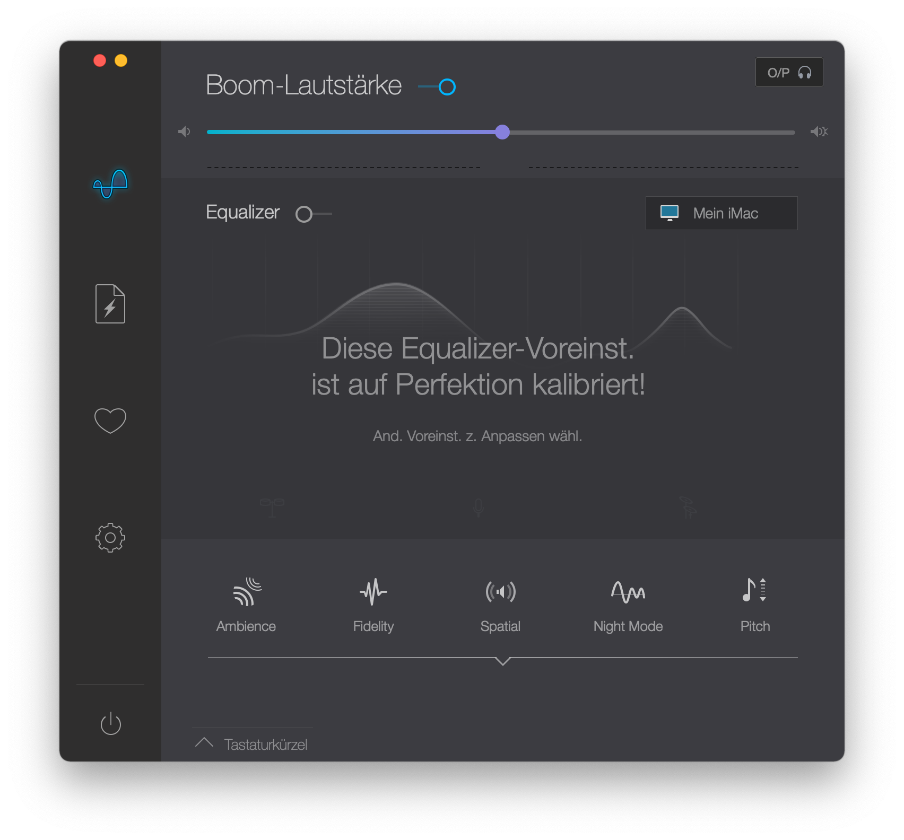

# Audio P8P67

## Install VoodooHDA.kext in macOS Monterey

- Follow instructions of [Asus-Z590-P-Hackintosh/Docs/AUDIO](https://github.com/rafaelmaeuer/Asus-Z590-P-Hackintosh/tree/master/Docs/AUDIO.md).

## Increase Audio-Volume

As the maximum audio volume with VodooHDA can be insufficient, [Boom 2](https://www.globaldelight.com/boom/boom2.php) can be used as system-wide volume booster.

- Install `Boom 2` (download [Trial](https://www.globaldelight.com/storefs/thankyou_free_boom2.php) or [Buy](https://www.globaldelight.com/store/?product=boom2)) and the [Boom 2 Audio Component](https://www.globaldelight.com/boom/mas-content/device-installer.php) if asked for.
- Use the following settings, which allow a satisfying volume for audio output on P8P67:

  