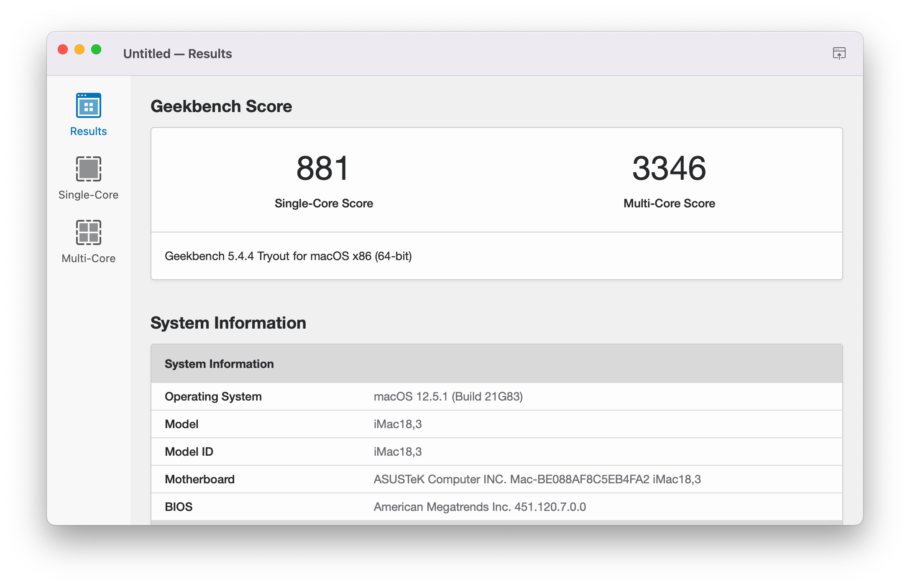
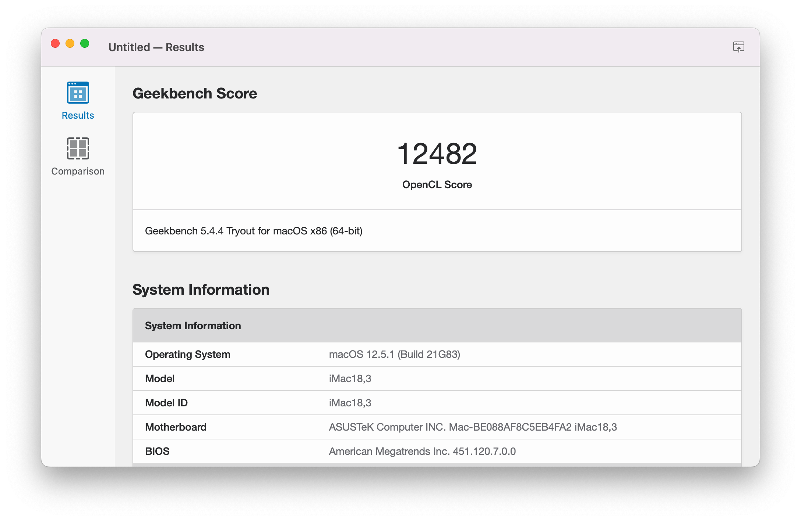
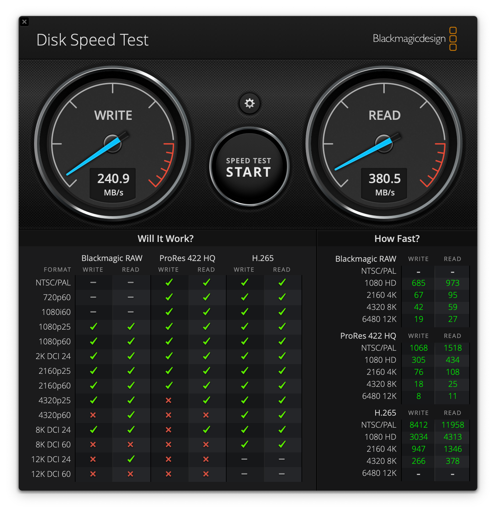

## ASUS P8P67 PRO/EVO Hackintosh

Install macOS Monterey on ASUS P8P67 PRO/EVO (REV3.0) Mainboard with Sandy Bridge CPU.


### Information

This Hackintosh was created with help of [Qraxin/Asus-P8P67-OpenCore-EFI](https://github.com/Qraxin/Asus-P8P67-OpenCore-EFI) repository and OpenCore guide [Desktop Sandy Bridge](https://dortania.github.io/OpenCore-Install-Guide/config.plist/sandy-bridge.html) as base.

- macOS: [Monterey 12.5.1](https://support.apple.com/en-us/HT212585)
- bootloader: [OpenCore 0.8.3](https://github.com/acidanthera/OpenCorePkg/releases/tag/0.8.3)

<a href="https://www.buymeacoffee.com/rafaelmaeuer"></a>

---

**Table of Contents**

- [ASUS P8P67 PRO/EVO Hackintosh](#asus-p8p67-proevo-hackintosh)
  - [Information](#information)
    - [Hardware](#hardware)
    - [Performance](#performance)
  - [Install macOS](#install-macos)
    - [1. Installer-Drive](#1-installer-drive)
    - [2. BIOS Settings](#2-bios-settings)
    - [3. Install macOS](#3-install-macos)
    - [4. Post Install](#4-post-install)
  - [Update macOS](#update-macos)
  - [DualBoot Windows](#dualboot-windows)
  - [Resources](#resources)
    - [Boot Flags](#boot-flags)
    - [ACPI Patches](#acpi-patches)
    - [Kexts](#kexts)
    - [Tools](#tools)
    - [Troubleshooting](#troubleshooting)
  - [Links and Documentation](#links-and-documentation)

---

#### Hardware

| Component | Variant                                                                                  | Link                                                                                                                                                                                                                                                                                                                                                                                                                       |
| --------- | ---------------------------------------------------------------------------------------- | -------------------------------------------------------------------------------------------------------------------------------------------------------------------------------------------------------------------------------------------------------------------------------------------------------------------------------------------------------------------------------------------------------------------------- |
| Mainboard | ASUS P8P67 PRO /<br> ASUS P8P67 EVO                                                      | [origin-www.asus.com](https://origin-www.asus.com/Motherboards/P8P67_PRO/) <br> [origin-www.asus.com](https://origin-www.asus.com/Motherboards/P8P67_EVO/)                                                                                                                                                                                                                                                                 |
| Processor | Intel Core i7 2600K                                                                      | [ark.intel.com](https://ark.intel.com/content/www/de/de/ark/products/52214/intel-core-i7-2600k-processor-8m-cache-up-to-3-80-ghz.html)                                                                                                                                                                                                                                                                                     |
| DDR3 RAM  | RipjawsX DDR3 16GB                                                                       | [www.gskill.com](https://www.gskill.com/product/165/176/1532311840/F3-10666CL9Q-16GBXLRipjawsXDDR3-1333MHz-CL9-9-9-1.50V16GB-(4x4GB))                                                                                                                                                                                                                                                                                      |
| SSD       | Samsung 870 EVO                                                                          | [www.samsung.com](https://www.samsung.com/de/memory-storage/sata-ssd/870-evo-250gb-sata-3-2-5-ssd-mz-77e250b-eu/)                                                                                                                                                                                                                                                                                                          |
| Graphics  | Asus Radeon RX 570 /<br> MSI GeForce GTX 760 /<br> Sapphire Radeon R7 250X               | [www.asus.com](https://www.asus.com/motherboards-components/graphics-cards/all-series/AREZ-STRIX-RX570-O4G-GAMING) <br> [de.msi.com](https://de.msi.com/Graphics-Card/N760-TF-2GD5OC.html) <br> [www.techpowerup.com](https://www.techpowerup.com/gpu-specs/sapphire-r7-250x.b2746)                                                                                                                                        |
| WiFi / BT | ASUS PCE-AC58BT + BCM94352Z /<br> ASUS PCE-AC55BT B1 + BCM4352 /<br> Fenvi FV T919 PCI-E | [www.amazon.de](https://re-link.info/hackintosh/ac58bt) \| [www.amazon.de](https://re-link.info/hackintosh/bcm94352z) <br> [www.asus.com](https://www.asus.com/de/Networking-IoT-Servers/Adapters/All-series/PCE-AC55BT-B1/) \| [osxlatitude.com](https://osxlatitude.com/forums/topic/2767-broadcom-bcm4352-80211-ac-wifi-and-bluetooth-combo-card/) <br>   [www.fenvi.com](https://www.fenvi.com/product_detail_16.html) |
| USB 3.0   | Inateck USB 3.0 PCIe KT4006                                                              | [www.amazon.de](https://re-link.info/hackintosh/kt4006)                                                                                                                                                                                                                                                                                                                                                                    |

#### Performance

Geekbench 5 Score of Intel Core i7 2600K CPU


Geekbench 5 Score (Metal) of Radeon R7 250X GPU


Blackmagic Disk Speed of Samsung 870 EVO SSD


---

### Install macOS

#### 1. Installer-Drive

**a) macOS Installer**

To create a working macOS Installer-Drive, you need the following:

- An empty USB flash drive (minimum 16GB)
- A device already running macOS

Create an USB Installer-Drive with [OpenCore Legacy Patcher](https://github.com/dortania/OpenCore-Legacy-Patcher) following the [How to install macOS Monterey on an unsupported Mac](https://www.intego.com/mac-security-blog/how-to-keep-older-macs-secure-a-geeky-approach/) guide.

**b) OpenCore**

- Download latest OpenCore: [acidanthera/opencorepkg](https://github.com/acidanthera/opencorepkg/releases)
  - Chose `debug` for installation and testing or `release` for final use
- Mount `EFI` partition of Installer-Drive (e.g. with OpenCore Configurator)
- Follow this guide [OpenCore-Install-Guide](https://dortania.github.io/OpenCore-Install-Guide/installer-guide/)
  - Basically the files mentioned in [file-swaps](https://dortania.github.io/OpenCore-Install-Guide/troubleshooting/debug.html#file-swaps) need to be copied/updated
    - Add `OpenCanopy.efi` to `EFI/OC/Drivers` for GUI picker
    - Add `VBoxHfs.efi` to `EFI/OC/Drivers` for HFS+ support
  - Repeat this step when switching from `debug` to `release` version

**c) Patches and Kexts**

- Copy all ACPI patches from/to `EFI/OC/ACPI/`
- Copy `config.plist` from/to `EFI/OC/config.plist`
- Copy all kexts from/to `EFI/OC/Kexts/`

---

#### 2. BIOS Settings

- Update to version 3602 (firmware in [BIOS](/BIOS) folder)
- Use following BIOS settings (F8/DEL on boot):

  ```sh
  EZ-Mode
  - System Performance
    - Asus Optimized

  Advanced Mode
  - Advanced
    - CPU
      - Ai Overclock Tuner: X.M.P.
      - Intel VT-d: Enabled
    - SATA
      - Mode Selection: AHCI
      - S.M.A.R.T.: Enabled
    - USB
      - Legacy: Enabled
      - Legacy USB 3.0: Enabled
      - EHCI Hand-off: Enabled
    - Onboard Devices
      - Renesas USB 3.0: Disabled
      - Bluetooth: Disabled
      - VIA 1394: Disabled
      - Marvell Storage: AHCI
      - Serial Port: Disabled
  - Boot
    - PCI ROM: Legacy ROM
    - Option ROM: Force BIOS
  ```

---

#### 3. Install macOS

- Connect Installer-Drive to USB2 port
- Boot from Installer-Drive (`F8` on BIOS post -> `[UEFI] USB Drive`)
- Select macOS Installer (`Install macOS Monterey`)
- Begin installation on APFS formatted SSD
- Finish the initial macOS setup process

---

#### 4. Post Install

**a) OpenCore**

- After successful install copy OpenCore to system EFI partition
- Repeat steps 1b + 1c but with EFI of macOS SSD as target
  - Switch OpenCore from `debug` to `release` version ([file-swaps](https://dortania.github.io/OpenCore-Install-Guide/troubleshooting/debug.html#file-swaps))
  - To disable all logging apply following [config-changes](https://dortania.github.io/OpenCore-Install-Guide/troubleshooting/debug.html#config-changes)

**b) Sleep/Wake**

- Read and follow instructions in [Docs/SLEEP](Docs/SLEEP.md).

**c) Tools**

- Install the following from [Tools](/Tools) folder:
  - `Intel Power Gadget` to test CPU frequency and speed stepping
  - `OpenCore Configurator` (OCC) to modify/update `config.plist`
  - `Hackintool` to check for loaded kexts and system settings

**d) Audio**

- (Optional) Install VoodooHDA by following instructions in [Docs/AUDIO](Docs/AUDIO.md).

---

### Update macOS

Check the official update-guide: [OpenCore-Post-Install/update](https://dortania.github.io/OpenCore-Post-Install/universal/update.html)

1. Backup
   - Full system backup with `Time Machine` or similar software
   - Copy current EFI to OpenCore USB-Drive for recovery purpose
2. Download
   - Latest version of OpenCore and replace files in EFI
   - Updates for all installed kexts and replace in EFI
3. Reboot
   - Boot with updated OpenCore version and kexts
   - If the system doesn't boot, use OpenCore USB-Drive to roll back
4. Update
   - Start macOS Update from `System Settings` -> `Software Update`
   - With OpenCore the update process should work automatically
   - If `Software Update` shows `Mac version is up to date`, download macOS Installer from AppStore and start the update manually

If the system doesn't boot, try to fix the problem or revert to the latest EFI or system-backup.

---

### DualBoot Windows

1. Install
   - Create new partition (~106 GB min) with `disk utility`
   - Create a Windows 11 Installer-Drive with either
     - [Rufus](https://rufus.ie/) (no TPM/ no Secure Boot) or
     - Media Creation Tool (copy [Windows/Install/bypass.reg](Windows/Install/bypass.reg) to Installer-Drive)
   - Select `Windows` boot entry in OpenCanopy to begin installation
   - Delete the partition from installer and let Windows re-create it
     - (follow [Windows 11 nun installieren und die Regdatei für den Bypass nutzen](https://www.deskmodder.de/wiki/index.php?title=Windows_11_auch_ohne_TPM_und_Secure_Boot_installieren) for bypass.reg)

2. Drivers
   - Unzip drivers in [Windows/Driver](Windows/Driver/) folder and install manually from Device-Manager
     - for "unknown device" select `Microsoft Engine Interface` as driver
     - for "BCM43525" select `DW1560 Bluetooth 4.0 LE` as driver
   - For Magic Mouse scrolling install `AppleWirelessMouse64.exe` from [Windows/Mouse](Windows/Mouse/) folder

3. Fixes
   - For Scroll-Inversion follow the instructions from [windowscentral.com](https://www.windowscentral.com/how-reverse-scrolling-direction-windows-10)
   - For Keyboard remapping use [AutoHotkey](https://www.autohotkey.com/) and [SharpKeys](https://github.com/randyrants/sharpkeys) with proper config files from [Windows/Keyboard](Windows/Keyboard/) folder
   - Fix incorrect clock settings by instructions from [lifehacker.com](https://lifehacker.com/fix-incorrect-clock-settings-in-windows-when-dual-booti-5742148)
   - Currently there are two concurrent problems:
     - Don't install BT-Driver in Windows: Mouse works on both OS while restart, but no Scroll in Windows
     - Install BT-Driver in Windows: Scrolling in Windows works, but restart breaks connection for other OS

---

### Resources

Basic information to run this Hackintosh. For more detailed information see [Docs/CONFIG](Docs/CONFIG.md).

#### Boot Flags

The following bootflags are required for boot:

- [alcid=7](https://github.com/acidanthera/AppleALC/blob/master/Resources/ALC882/Info.plist) for ALC882 audio config (5/6 ports)
- [brcmfx-country=XX](https://github.com/acidanthera/AirportBrcmFixup#specific-boot-args-and-ioreg-properties) changes the wifi country code to XX (US, DE, ...)
- [darkwake=0](https://dortania.github.io/OpenCore-Post-Install/usb/misc/keyboard.html#method-3-configuring-darkwake) fixes `Wake by RTC/Maintenance`
- [radpg=15](https://github.com/acidanthera/WhateverGreen#features) fixes R7 250X initialisation

#### ACPI Patches

Find the following SSDT patches (recommended by [dortania](https://dortania.github.io/Getting-Started-With-ACPI/ssdt-methods/ssdt-prebuilt.html#desktop-sandy-and-ivy-bridge)) in [ACPI](ACPI) folder:

| Patch                    | Name               | Link                                                                                                     |
| ------------------------ | ------------------ | -------------------------------------------------------------------------------------------------------- |
| Fix Embedded Controller  | SSDT-EC-USBX.aml   | [dortania/acpi/ec-fix](https://dortania.github.io/Getting-Started-With-ACPI/Universal/ec-fix.html)       |
| Fix Wake from Bluetooth* | SSDT-GPRW.aml      | [dortania/usb/instant-wake](https://dortania.github.io/OpenCore-Post-Install/usb/misc/instant-wake.html) |
| Fix SMBus support        | SSDT-SBUS-MCHC.aml | [dortania/acpi/smbus](https://dortania.github.io/Getting-Started-With-ACPI/Universal/smbus.html)         |

*\*Use in combination with [GPRW to XPRW Patch](https://github.com/dortania/OpenCore-Post-Install/blob/master/extra-files/GPRW-Patch.plist). Not needed when using a `BCM94360CD Fenvi` card.*

---

#### Kexts

| Type               | Kext                                                                  | Version          | Author                                                                                                                              |
| ------------------ | --------------------------------------------------------------------- | ---------------- | ----------------------------------------------------------------------------------------------------------------------------------- |
| Audio              | AppleALC /<br> VodooHDA.kext*                                         | 1.7.4 <br> 2.9.9 | [acidanthera/AppleALC](https://github.com/acidanthera/AppleALC) <br> [sourceforge.net](https://sourceforge.net/projects/voodoohda/) |
| Bluetooth          | BlueToolFixup.kext <br> BrcmFirmwareData.kext <br> BrcmPatchRAM3.kext | 2.6.3            | [acidanthera/BrcmPatchRAM](https://github.com/acidanthera/BrcmPatchRAM)                                                             |
| Ethernet (Intel)   | IntelMausi.kext                                                       | 1.0.7            | [Mieze/LucyRTL8125Ethernet](https://github.com/Mieze/LucyRTL8125Ethernet)                                                           |
| Ethernet (Realtek) | AppleRTL8169Ethernet.kext                                             | 1.0.0            | [Realtek/RTL8110SC(L)](https://www.realtek.com/en/component/zoo/category/rtl8110sc-l-s)                                             |
| Graphics           | WhateverGreen.kext                                                    | 1.6.1            | [acidanthera/WhateverGreen](https://github.com/acidanthera/WhateverGreen)                                                           |
| Patch Engine       | Lilu.kext                                                             | 1.6.2            | [acidanthera/Lilu](https://github.com/acidanthera/Lilu)                                                                             |
| Sensors            | VirtualSMC.kext <br> SMCSuperIO.kext <br>  SMCProcessor.kext          | 1.3.0            | [acidanthera/VirtualSMC](https://github.com/acidanthera/VirtualSMC)                                                                 |
| USB Map            | USBMap.kext                                                           | 1.0              | [rafaelmaeuer/P8P67Pro/USB](https://github.com/rafaelmaeuer/Asus-P8P67Pro-Hackintosh/tree/master/USB/Results/.kext)                 |
| (USB Map  Helper   | USBInjectAll.kext                                                     | 0.7.6            | [Sniki/OS-X-USB-Inject-All](https://github.com/Sniki/OS-X-USB-Inject-All))                                                          |
| WiFi               | AirportBrcmFixup.kext                                                 | 2.1.6            | [acidanthera/AirportBrcmFixup](https://github.com/acidanthera/AirportBrcmFixup)                                                     |

*\*Kext needs special setup, see [Asus-Z590-P-Hackintosh/Docs/AUDIO](https://github.com/rafaelmaeuer/Asus-Z590-P-Hackintosh/blob/master/Docs/AUDIO.md)*

---

#### Tools

| Name                  | Version  | Download                                                                                                    |
| --------------------- | -------- | ----------------------------------------------------------------------------------------------------------- |
| Hackintool            | 3.8.7    | [headkaze/Hackintool](https://github.com/headkaze/Hackintool/)                                              |
| Intel Power Gadget    | 3.7.0    | [software.intel.com](https://software.intel.com/content/www/us/en/develop/articles/intel-power-gadget.html) |
| IORegistryExplorer    | 2.1      | [vulgo/IORegistryExplorer](https://github.com/vulgo/IORegistryExplorer)                                     |
| MaciASL               | 1.6.2    | [acidanthera/MaciASL](https://github.com/acidanthera/MaciASL/)                                              |
| OpenCore Configurator | 2.62.0.0 | [mackie100projects](https://mackie100projects.altervista.org/download-opencore-configurator/)               |
| ssdtPRGen             | 17.0     | [Piker-Alpha/ssdtPRGen](https://github.com/Piker-Alpha/ssdtPRGen.sh)                                        |

---

#### Troubleshooting

For a list of tips and tricks for already known problems see [Docs/TROUBLE](Docs/TROUBLE.md).

---

### Links and Documentation

Find more links and documentation in [Docs/LINKS](Docs/LINKS.md).
