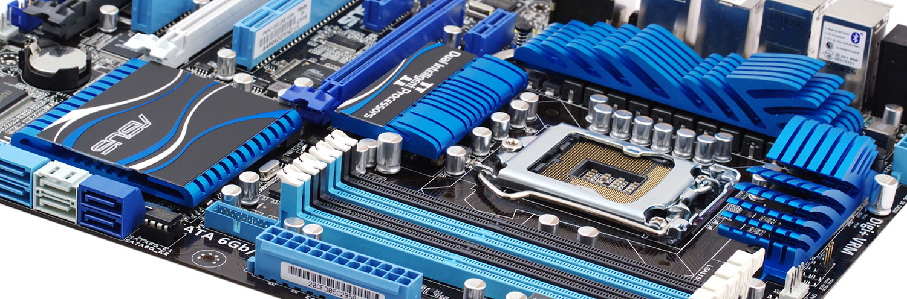

## ASUS P8P67 PRO/EVO Hackintosh

Guide about installing macOS Big Sur on ASUS P8P67 PRO/EVO (REV3.0) based PC



### Information

This Hackintosh was build with help of [Qraxin/Asus-P8P67-OpenCore-EFI](https://github.com/Qraxin/Asus-P8P67-OpenCore-EFI) repository and OpenCore guide [Desktop Sandy Bridge](https://dortania.github.io/OpenCore-Install-Guide/config.plist/sandy-bridge.html) as base.

- macOS: Big Sur 11.2.3
- bootloader: OpenCore 0.7.1

---

**Table of Contents**

- [ASUS P8P67 PRO/EVO Hackintosh](#asus-p8p67-proevo-hackintosh)
  - [Information](#information)
    - [BIOS](#bios)
    - [Hardware](#hardware)
  - [Install macOS](#install-macos)
    - [1. Create OpenCore Drive](#1-create-opencore-drive)
    - [2. Create macOS Installer Drive](#2-create-macos-installer-drive)
    - [3. Install macOS](#3-install-macos)
    - [4. Post Installation](#4-post-installation)
  - [Update macOS](#update-macos)
  - [OpenCore Config](#opencore-config)
  - [Troubleshooting](#troubleshooting)
  - [Resources](#resources)
    - [ACPI Patches](#acpi-patches)
    - [Advanced Config](#advanced-config)
    - [Kexts in use](#kexts-in-use)
    - [Optional Kexts](#optional-kexts)
    - [Drivers and Tools](#drivers-and-tools)
    - [Useful Links](#useful-links)

---

#### BIOS

- Use version 3602 (get ROM for PRO/EVO Board from [BIOS](/BIOS) folder)
- Check for correct BIOS settings (F8/DEL on post):

  ```sh
  EZ-Mode
  - System Performance
    - Asus Optimized

  Advanced Mode
  - Advanced
    - CPU
      - Intel VT-d: Enabled
    - SATA
      - Mode Selection: AHCI
      - S.M.A.R.T.: Enabled
    - USB
      - Legacy: Enabled
      - Legacy USB 3.0: Enabled
      - EHCI Hand-off: Enabled
    - Onboard Devices
      - Renesas USB 3.0: Disabled
      - Bluetooth: Disabled
      - VIA 1394: Disabled
      - Marvell Storage: AHCI
      - Serial Port: Disabled
  - Boot
    - PCI ROM: Legacy ROM
    - Option ROM: Force BIOS
  ```

#### Hardware

This Hackintosh was created on an [ASUS P8P67 PRO](https://origin-www.asus.com/Motherboards/P8P67_PRO/) Mainboard with an [Intel Core i7 2600K](https://ark.intel.com/content/www/de/de/ark/products/52214/intel-core-i7-2600k-processor-8m-cache-up-to-3-80-ghz.html) Processor and [16GB RipjawsX DDR3](https://www.gskill.com/product/165/176/1532311840/F3-10666CL9Q-16GBXLRipjawsXDDR3-1333MHz-CL9-9-9-1.50V16GB-(4x4GB)) RAM. It is running now on an [ASUS P8P67 EVO](https://origin-www.asus.com/Motherboards/P8P67_EVO/) Mainboard. [MSI GeForce GTX 760](https://de.msi.com/Graphics-Card/N760-TF-2GD5OC.html) and [Asus Radeon RX 570](https://www.asus.com/motherboards-components/graphics-cards/all-series/AREZ-STRIX-RX570-O4G-GAMING) graphic cards have been working with different display setups.

**Graphics**

[Asus Radeon RX 570](https://www.asus.com/motherboards-components/graphics-cards/all-series/AREZ-STRIX-RX570-O4G-GAMING) was used with two 4K Monitors on DP and HDMI (DVI has problems).  
[MSI GeForce GTX 760](https://de.msi.com/Graphics-Card/N760-TF-2GD5OC.html) was used with two Displays on DVI, no 4K on HDMI possible (v1.4a).

**WiFi**

For native WiFi and BT support a [BCM94360CD Fenvi FV T919](https://www.amazon.de/MQUPIN-BCM94360CD-Bluetooth-Netzwerkkarte-erforderlich/dp/B07W92MZGF) card is used to get Apple Watch Unlock working and reduce issues with BT. Alternatively an [ASUS PCE-AC55BT B1 PCI-E](https://www.asus.com/Networking-IoT-Servers/Adapters/All-series/PCE-AC55BT-B1/) adapter can be used with a [BroadCom BCM4352 BCM94352Z NGFF M.2](https://deviwiki.com/wiki/Broadcom_BCM94352Z) card as chip.

**Bluetooth**

The onboard Bluetooth is disabled. The Bluetooth of the Broadcom BCM94352Z causes unwanted wake from sleep, therefore a SSDT-GPRW patch is used. Alternatively a [Plugable Bluetooth 4 USB Adapter](https://plugable.com/products/usb-bt4le/) can be used (works ootb).

**SATA**

For eSATA/SATA and RAID a [DIGITUS DS-30104-1 PCI-E](https://www.digitus.info/de/produkte/computer-und-office-zubehoer/computer-zubehoer/io-karten/ds-30104-1/) card is used as the MARVELL 88SE9230 chip works with the [CtlnaAHCIPort.kext](https://github.com/dortania/OpenCore-Install-Guide/blob/master/extra-files/CtlnaAHCIPort.kext.zip).

**USB**

USB2 works ootb but a port mapping was created in the attempt of avoiding unwanted wake from sleep which is caused by the internal USB-connector of the BT-card. As the most promising solution (setting the USB-connector type to internal/255) is not working (BT isn't recognized anymore), the current solution is a [SSDT-GPRW](https://dortania.github.io/USB-Map-Guide/misc/instant-wake.html) patch which disables wake by usb completely.

**USB3**

For USB3 an [Inateck KT4006 PCI-E](https://www.inateck.com/inateck-kt4006-dual-port-usb-3-0-pci-express-card-20-pin-connector-no-power-connection.html) card (FL1100) is used which works ootb. The internal NEC/Renesas USB3.0 controller doesn't work on Big Sur and is disabled in bios.

---

### Install macOS

#### 1. Create OpenCore Drive

**a) Preparation**

- Format USB-Drive with GUID and APFS ([Link](https://www.howtogeek.com/272741/how-to-format-a-drive-with-the-apfs-file-system-on-macos-sierra/))

  - Find the correct disk number of USB-Drive:

    ```sh
    diskutil list
    ```

  - Replace {n} with corresponding disk number and {Volume} with desired Name:

    ```sh
    diskutil apfs createContainer /dev/disk{n}
    diskutil apfs addVolume disk{n} APFS {Volume}
    ```

- Download latest OpenCore: [acidanthera/opencorepkg](https://github.com/acidanthera/opencorepkg/releases)
  - Chose `debug` for installation and config or `release` for final use

**b) Install OpenCore**

- Follow this guide [OpenCore-Install-Guide](https://dortania.github.io/OpenCore-Install-Guide/installer-guide/)
  - Basically the files mentioned in [file-swaps](https://dortania.github.io/OpenCore-Install-Guide/troubleshooting/debug.html#file-swaps) need to be copied/updated
    - Copy `OpenCanopy.efi` to `EFI/OC/Drivers` for GUI picker
    - Copy `VBoxHfs.efi` to `EFI/OC/Drivers` for HFS+ support
  - Repeat this step when switching from `debug` to `release` version

**c) Add Config and Kexts**

- Copy all ACPI patches from/to `EFI/OC/ACPI/`
- Copy `config.plist` from/to `EFI/OC/config.plist`
- Copy all kexts from/to `EFI/OC/Kexts/`

---

#### 2. Create macOS Installer Drive

To create a working macOS Installer boot drive, you will need the following:

- An empty USB3 flash drive (minimum 32GB)
- A device already running macOS with App Store access

**a) Download macOS Installer**

- Open the Mac App Store on a device running macOS
- Download `Install macOS Big Sur` application
- Close Installer when it opens automatically

**b) Create Installer Stick**

- Follow this guide: [macOS Big Sur 11: bootbaren USB-Stick erstellen](https://www.zdnet.de/88389660/macos-big-sur-11-bootbaren-usb-stick-erstellen/)
  
  Create installer stick with this command:

  ```sh
  sudo /Applications/Install\ macOS\ Big\ Sur.app/Contents/Resources/createinstallmedia --volume /Volumes/Big\ Sur/ --nointeraction
  ```

**c) Patch Installer Stick**

Enable installation on unsupported hardware:
  
- Download and unpack: [barrykn/big-sur-micropatcher](https://github.com/barrykn/big-sur-micropatcher/releases)
- Execute in Terminal
  
  ```sh
  ~/Downloads/big-sur-micropatcher-main/micropatcher.sh
  ```

---

#### 3. Install macOS

- Connect macOS Installer and OpenCore Drive to your target machine
- Boot from OpenCore Drive (`F8` on BIOS post -> `[UEFI] OpenCore Drive`)
- Select macOS Installer (`Install macOS Big Sur`)
- Begin installation on APFS formatted HDD/SSD
- On reboots select `(Install) Big Sur` drive (auto)
- Finish the initial macOS setup process

---

#### 4. Post Installation

**a) OpenCore**

- After successful install copy OpenCore to system EFI partition
- Repeat steps 1b - 1c but with EFI on macOS HDD as target
  - Switch OpenCore from `debug` to `release` version ([file-swaps](https://dortania.github.io/OpenCore-Install-Guide/troubleshooting/debug.html#file-swaps))
  - To disable all logging apply following [config-changes](https://dortania.github.io/OpenCore-Install-Guide/troubleshooting/debug.html#config-changes)

**b) System-Tools**

- Install the following from [Tools](/Tools) folder:
  - `Intel Power Gadget` to test CPU frequency and speed stepping
  - `OpenCore Configurator` (OCC) to modify/update `config.plist`
  - `Hackintool` to check for loaded kexts and system settings

**c) Drivers**

- Install `Marvell RAID Utility` (MSU) from [Driver](/Driver) folder
- Open `MarvellTray` App from Programs and login with macOS user credentials

---

### Update macOS

- Make a full backup with `Time Machine` or similar software
- Check the official update-guide: [OpenCore-Post-Install/update](https://dortania.github.io/OpenCore-Post-Install/universal/update.html)
- Download latest version of OpenCore
- Download updates for all installed kexts
- Update OpenCore Drive for testing purpose
  - Use latest OpenCore, kexts and drivers
- Boot from OpenCore Drive
- If the system boots
  - Mount EFI partition of macOS HDD
  - Replace EFI from OpenCore Drive
- If the system boots
  - Start macOS Update from `System Settings` -> `Software Update`
  - With OpenCore the update process should work automatically
    - If `Software Update` shows `Mac version is up to date`, download macOS Installer from AppStore and initialize the update manually
- If system doesn't boot on one of these steps
  - Try to fix the problem or revert to the latest backup

---

### OpenCore Config

For adding your SSDTs, Kexts and Firmware Drivers to create snapshots of your populated EFI folder ([link](https://dortania.github.io/OpenCore-Install-Guide/config.plist/#adding-your-ssdts-kexts-and-firmware-drivers)) use [corpnewt/ProperTree](https://github.com/corpnewt/ProperTree)

**Add ACPI patches**

To manually add ACPI patches do the following

- Copy `{name}.aml` into `EFI/OC/ACPI`
- Open `config.plist` in OCC
- Add new entry in `ACPI` -> `Add`
  - Add `{name}.aml` as Path
  - Add a meaningful `Comment`
  - Select `Enabled`

**Add kexts**

To manually add kexts do the following

- Copy `{name}.kext` into `EFI/OC/Kexts`
- Open `config.plist` in OCC
- Add new entry in `Kernel` -> `Add`
  - Add `x86_64` as Arch
  - Add `{name}.kext` as BundlePath
  - Add a meaningful `Comment`
  - If kext isn't codeless add `{name}` as ExecutablePath
  - Add `Contents/Info.plist` as PlistPath
  - (Optional: set `MinKernel` and `MaxKernel`)
  - Select `Enabled`

**Sanity Checker**

The OpenCore configuration can be validated by uploading the `config.plist` to [OpenCore Sanity Checker](https://opencore.slowgeek.com/) in order to perform a sanity check. It helps to find problems in the configuration and to optimize the setup.

---

### Troubleshooting

Tips and tricks to solve already known problems

**Reset NVRAM**

NVRAM can be reset from OpenCanopy boot picker if auxiliary-entries are displayed in OpenCore ([Link](https://www.reddit.com/r/hackintosh/comments/h0jkjl/hide_partitions_from_opencore_boot_screen/))

- Mount `EFI` and open `config.plist` with OCC
- Go to `Misc` -> `Boot` and set `HideAuxiliary = NO`
- On reboot select `Reset NVRAM` from tools

**Default Boot Option**

A default boot entry can be set with `ctrl + enter` if the option is allowed in OpenCore ([Link](https://www.reddit.com/r/hackintosh/comments/dze9kw/how_to_change_default_boot_option_for_opencore/))

- Mount `EFI` and open `config.plist` with OCC
- Go to `Misc` -> `Security` and set `AllowSetDefault = YES`
- In OpenCanopy boot picker set default with `ctrl + enter`

**Add Boot Entry**

As the P8P67 bios offers no option to simply add new boot entries, [EasyUEFI](https://www.easyuefi.com/index-us.html) from a parallel windows installation is used to create OpenCore boot entry

- Follow this guide [Manually install Clover for UEFI booting and configure boot priority with EasyUEFI in Windows](https://www.insanelymac.com/forum/topic/310038-manually-install-clover-and-configure-boot-priority-with-easyuefi-in-windows/) and use `EFI/BOOT/BOOTx64.efi` as file path

**Boot Resolution**

The display resolution during boot is very low, full display resolution (4K) is only reached on the last boot stage

- Default options `TextRenderer` set to `BuiltinGraphics` and `Resolution` set to `Max` ([macos-decluttering](https://dortania.github.io/OpenCore-Post-Install/cosmetic/verbose.html#macos-decluttering)) deliver best results (1280x800 or similar)
- Custom options like `TextRenderer` set to `SystemGraphics` and `Resolution` set to `3840x2160` deliver worse results (1024x768 fallback)
- Setting `UIScale` to `02` (HiDPI-Mode) only increases the icon size
- Switching the BIOS settings from `Legacy ROM` to `UEFI ROM` has no improvement as suggested [here](https://www.reddit.com/r/hackintosh/comments/i8pc8t/gui_bootscreen_resolution_with_opencanopy_efi/), [there](https://www.reddit.com/r/hackintosh/comments/j9wyu7/stretched_opencore_boot_picker_and_apple_logo/) or [over there](https://www.reddit.com/r/hackintosh/comments/j3eab5/opencore_boot_menu_low_resolution_on_ultrawide/)
  - 🚨 Warning 🚨 ASUS RX570 doesn't work with `UEFI ROM` settings (black screen -> needs CMOS-reset), although latest official [firmware](https://www.techpowerup.com/vgabios/191598/asus-rx570-4096-170327) has UEFI-support
  - GeForce GTX 760 works with `UEFI ROM` BIOS-settings, but doesn't improve resolution during boot. The latest official [firmware](https://www.techpowerup.com/vgabios/162810/msi-gtx760-2048-140306) also has UEFI-support
- The problem might be related with [CSM](https://superuser.com/questions/1284392/what-exactly-is-uefi-with-csm-boot-mode) or [GOP](https://wiki.osdev.org/GOP) for graphic cards

**Boot Theme**

As the best possible boot resolution with 1280x800 has a width distortion of 1.28 (1024/800) a custom boot theme is used with inverse distorted images to compensate. Modify Images:

- Open `.icns` file with apple preview
- Drag and Drop `.tiff` images to folder
- Resize Image width to 78,125% (1024/800)
- Resize Image area to original width
- Save Images as .png
- Create `.icns` image bundle
  ```sh
  cd /OpenCore/Utilities/icnspack/
  ./icnspack image.icns image.png image@2x.png
  ```
- Replace original image bundle

**AHCI Ports**

Information copied from [SATA Drives Not Shown in DiskUtility](https://www.olarila.com/topic/9616-error-while-installing-big-sur/?do=findComment&comment=117695)

- Make sure SATA Mode is AHCI in bios
- Certain SATA controllers may not be officially supported by macOS, for these cases you'll want to grab [CtlnaAHCIPort.kext](https://github.com/dortania/OpenCore-Install-Guide/blob/master/extra-files/CtlnaAHCIPort.kext.zip)
  - For very legacy SATA controllers, [AHCIPortInjector.kext](https://www.insanelymac.com/forum/files/file/436-ahciportinjectorkext/) may be more suitable

**Apple Watch Unlock**

If unlock with Apple Watch doesn't work or make problems although using a `BCM94360CD Fenvi` card, follow the steps of this blogpost comment: [watchOS 7 Beta 5 - unlock mac doesn't work](https://forums.macrumors.com/threads/watchos-7-beta-5-unlock-mac-doesnt-work.2250819/page-2?post=28904426#post-28904426). Afterwards unlock with Apple Watch works like it should with a regular Mac.

---

### Resources

Useful information, tips and tutorials used to create this Hackintosh

#### ACPI Patches

Several SSDT patches are used to fix following problems

- [SSDT-EC-USBX.aml](https://dortania.github.io/Getting-Started-With-ACPI/Universal/ec-fix.html) fixes embedded controller and USB
- [SSDT-GPRW.aml](https://dortania.github.io/OpenCore-Post-Install/usb/misc/instant-wake.html) prevents instant wake from sleep (BT/USB)
  - Not needed when using a `BCM94360CD Fenvi` card
- [SSDT-PM.aml](https://dortania.github.io/OpenCore-Post-Install/universal/pm.html#sandy-and-ivy-bridge-power-management) fixes power management and cpu speed stepping
- [SSDT-SBUS-MCHC.aml](https://dortania.github.io/Getting-Started-With-ACPI/Universal/smbus.html) fixes AppleSMBus support

---

#### Advanced Config

The following configurations are not essential for the Hackintosh to work, but they improve functionality to get as close to a real Mac as possible.

**Power Management**

As `iMac12,2` is the closest SMBIOS to P8P67 mainboards ([link](https://dortania.github.io/OpenCore-Install-Guide/config.plist/sandy-bridge.html#platforminfo)), it is used to generate SSDT for power-management. As `SSDT-PLUG` is only compatible with Intel's Haswell and newer CPUs ([link](https://dortania.github.io/Getting-Started-With-ACPI/Universal/plug.html)), Sandy Bridge needs to follow the [ssdtPRgen](https://dortania.github.io/OpenCore-Post-Install/universal/pm.html#sandy-and-ivy-bridge-power-management) method.

- OpenCore Configurator Paths
  - Drop ACPI: `ACPI` -> `Delete`
  - SMBIOS: `PlatformInfo` -> `SMBIOS` -> `Button Up/Down`
  - Boot-Args: `NVRAM` -> `UUID` -> `7C4...F82` -> `boot-args`

1. Select SMBIOS `iMac12,2` (CPU: Sandy Bridge i7 2600)
   - Add `-no_compat_check` boot-flag
   - Drop `CpuPm` and `Cpu0Ist` tables
   - Reboot with new SMBIOS

2. Use [ssdtPRGen.sh](https://github.com/Piker-Alpha/ssdtPRGen.sh) from [ACPI/Tools](/ACPI/Tools) folder to generate `SSDTs`
   - [Ignore](https://github.com/Piker-Alpha/ssdtPRGen.sh/issues/183#issuecomment-171089689) warning about improperly 'cpu-type' ([0x0703](https://docs.google.com/spreadsheets/d/1x09b5-DGh8ozNwN5ZjAi7TMnOp4TDm6DbmrKu86i_bQ/edit#gid=0&range=D18) instead of 0x0603)
   - Output folder: `~/Library/ssdtPRGen/`
   - Rename `SSDT.aml` to `SSDT-PM.aml`
   - Add to `EFI/OC/ACPI` and `config.plist`

3. Change SMBIOS to `iMac18,3` (GPU: Radeon Pro 570)
   - Set `ProzessorType` to `1795` (decimal for 0x0703)
   - Remove `-no_compat_check` boot-flag
   - Remove drop of `CpuPm` and `Cpu0Ist` tables
   - Reboot with new SMBIOS

**USB Mapping**

An USB port-mapping was created using this guide: [USB Anschlüsse Patchen](Manuals/USB%20Anschlüsse%20Patchen.pdf)  
The following exported files can be found in [USB](/USB) folder:

- `SSDT-EC-USBX.aml/dsl` patch files for EC and USBX
- `SSDT-UIAC.aml/dsl` patch file for
- `USBPorts.kext`

---

#### Kexts in use

**Patch Engine**: [acidanthera/Lilu](https://github.com/acidanthera/Lilu)

- Lilu.kext (v1.5.4)

**Graphics**: [acidanthera/WhateverGreen](https://github.com/acidanthera/WhateverGreen)

- WhateverGreen.kext (v1.5.1)

**Sensors**: [acidanthera/VirtualSMC](https://github.com/acidanthera/VirtualSMC)

- VirtualSMC.kext (v1.2.5)
- SMCSuperIO.kext (v1.2.5)
- SMCProcessor.kext (v1.2.5)

**CPU Sync**: [acidanthera/CpuTscSync](https://github.com/acidanthera/CpuTscSync)

- CpuTscSync.kext (v1.0.3)

**Audio**: [SourceForge/VoodooHDA](https://sourceforge.net/projects/voodoohda/)

- VoodooHDA.kext (v2.9.7)

**Ethernet (Intel)**: [acidanthera/IntelMausi](https://github.com/acidanthera/IntelMausi)

- IntelMausi.kext (v1.0.7)

**SATA**: [dortania/extra-files](https://github.com/dortania/OpenCore-Install-Guide/blob/master/extra-files/CtlnaAHCIPort.kext.zip)

- CtlnaAHCIPort.kext (v341.0.2)

#### Optional Kexts

**Audio**: [acidanthera/AppleALC](https://github.com/acidanthera/AppleALC/)

- AppleALC.kext

**Ethernet (Realtek)**: [Realtek/RTL8110SC(L)](https://www.realtek.com/en/component/zoo/category/rtl8110sc-l-s)

- AppleRTL8169Ethernet.kext

**WiFi**: [acidanthera/AirportBrcmFixup](https://github.com/acidanthera/AirportBrcmFixup)

- AirportBrcmFixup.kext

**Bluetooth**: [acidanthera/BrcmPatchRAM](https://github.com/acidanthera/BrcmPatchRAM)

- BrcmBluetoothInjector.kext
- BrcmFirmwareData.kext
- BrcmPatchRAM3.kext

---

#### Drivers and Tools

**Driver**

- [MSU for macOS](http://clouddisk.raidon.com.tw/%E7%B6%B2%E7%AB%99%E5%B0%88%E7%94%A8/STARDOM/Program/9580/)

**Tools**

- [Intel Power Gadget](https://software.intel.com/content/www/us/en/develop/articles/intel-power-gadget.html)
- [OpenCore Configurator](https://mackie100projects.altervista.org/download-opencore-configurator/)
- [headkaze/Hackintool](https://github.com/headkaze/Hackintool/)
- [Piker-Alpha/ssdtPRGen](https://github.com/Piker-Alpha/ssdtPRGen.sh)
- [acidanthera/MaciASL](https://github.com/acidanthera/MaciASL)

---

#### Useful Links

**Nec Renesas uPD720200**

The internal USB3.0 could be activated with `GenericUSBXHCI.kext` prior macOS Big Sur. But it caused unwanted restarts as an unwanted side effect.

- [RehabMan/GenericUSBXHCI.kext](https://bitbucket.org/RehabMan/os-x-generic-usb3/downloads/)
- [How to get Nec Renesas uPD720200 USB3.0 to work?](https://www.insanelymac.com/forum/topic/308452-how-to-get-nec-renesas-upd720200-usb30-to-work/)
- [NEC/Renesas uPD720200A USB3.0 XHCI controller support](https://www.tonymacx86.com/threads/nec-renesas-upd720200a-usb3-0-xhci-controller-support.233130/)

**Realtek RTL8110SC/8169SC**

The second ethernet controller is a Realtek RTL8110SC/8169SC which can probably be activated by `AppleRTL8169Ethernet.kext`, but not `RealtekRTL8111.kext` (check the links).

- [Is RTL-8110SC/8169SC supported?](https://github.com/Mieze/RTL8111_driver_for_OS_X/issues/64)
- [Is RTL-8110 working with RealtekRTL8111.kext?](https://github.com/Qraxin/Asus-P8P67-OpenCore-EFI/issues/3)
- [RTL8169 worked on 10.13.2 perfect!](https://www.tonymacx86.com/threads/rtl8169-worked-on-10-13-2-perfect.267556/)
- [Driver for Realtek's RTL810x Fast Ethernet Series](https://www.insanelymac.com/forum/topic/296190-driver-for-realteks-rtl810x-fast-ethernet-series/)